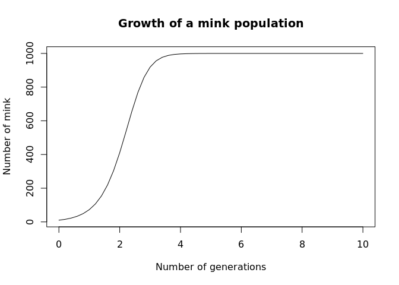

Modelling the invasive American Mink in the Pyrenees
================

## The system

In the Pyrenees, several small carnivores compete for habitat and prey.
Of these, the [European
mink](https://en.wikipedia.org/wiki/European_mink) is highly threatened,
due to competition with the invasive [American
mink](https://en.wikipedia.org/wiki/American_mink). The population of
European Mink in the Pyrenees is one of the last remaining in Europe,
and conservation of the species depends on us finding a way to mitigate
the threats in this region.

The European and American mink are both semi-aquatic
[mustelids](https://en.wikipedia.org/wiki/Mustelidae) which have
relatively small territories on rivers or coasts. They hunt small
rodents, birds, fish, and crustaceans. Despite the similarities that
have led to their common name, they are members of distinct evolutionary
lineages, with the European mink being more closely related to weasels
and ferrets than the American mink. Therefore, their similar lifestyles
are an example of [convergent
evolution](https://en.wikipedia.org/wiki/Convergent_evolution).

## A simple model

To start with, let’s imagine how the population of the European mink
looked before the invasive species arrived. We can imagine that there is
a certain amount of mink that can be supported by the environment (the
[carrying capacity](https://en.wikipedia.org/wiki/Carrying_capacity))
and that the population of mink grows when there are a lower number of
individuals than the carrying capacity will support. If the population
exceeds the carrying capacity, then more individuals will die than will
survive (due to limited resources) and the population will shrink. This
model is called the [logistic
model](https://en.wikipedia.org/wiki/Logistic_function#In_ecology:_modeling_population_growth),
and it’s written like this:

  
")  

This equation tells us how the population changes over time.
 is the number of mink at any given time.
 is the carrying capacity – let’s assume that the environment can
support 1,000 individuals for now.
 is the per-capita [*intrinsic growth
rate*](https://en.wikipedia.org/wiki/Population_dynamics#Intrinsic_rate_of_increase),
we can get the value for this from the litter size of the mink. The
European mink has an average litter size of five kits, so the per-capita
rate of increase is
 (since only females bear offspring). The term  decreases as
 gets close to
 – this means that fewer and fewer offspring survive until adulthood
as we get closer to the carrying capacity – which makes sense, since
there are fewer resources remaining.

Let’s model this\[1\].

``` r
logistic <- function(X) {
        # Define the parameters.
        K <- 1000
        r <- 2.5
        # Calculate the result from the model.
        res <- r * X * (1 - X / K)
        return(res)
}
```

``` r
res <- run_simulation(
        logistic,   # Use our model.
        X = 10,     # Start with 10 individuals.
        N = 10      # Run it for 20 generations (ie. years).
)
```

``` r
# Plot our results.
plot(
        res[, 1], res[, 2],
        type = "l",    # For a line graph
        xlab = "Number of generations",
        ylab = "Number of mink",
        main = "Growth of a mink population"
)
```

<!-- -->

We can see that the population initially grows very quickly, before
levelling out at the carrying capacity. If we look closely, we can see
that it only took four generations to get to 1,000 individuals\! The
power of [exponential
growth](https://en.wikipedia.org/wiki/Exponential_growth#Biology).

**Exercise:** If the average litter size is reduced to three kits –
perhaps by some chemical pollutant – how long will it now take the
population of mink to reach the carrying capacity?

## Introducing competition TODO

Now that we have a simple model of our population of European mink in
isolation, let’s see what happens when we have an invasion of American
mink. We can extend the logistic model above into a pair of equations
called the [Lotka-Volterra competition
model](https://en.wikipedia.org/wiki/Competitive_Lotka%E2%80%93Volterra_equations):

  
 \\\\
\\frac{\\textrm{d}y}{\\textrm{d}t} = 
        r y \\left( 1 - \\frac{y + \\alpha_{yx} x}{K} \\right)")  

Now we have two populations,
 and
, that interact with each other. The first equation is fairly
similar to the logistic model we saw above, but now we see the
population of American mink is also contributing to reaching the
carrying capacity
 in the term  (we’ll talk more about the
 in a second).

## Extending the model TODO

As well as the two mink, other species with similar ranges include the
[red fox](https://en.wikipedia.org/wiki/Red_fox) and [European
badger](https://en.wikipedia.org/wiki/European_badger). Despite their
similar size and some overlap in food sources, these species have
importantly different [ecological
niches](https://en.wikipedia.org/wiki/Ecological_niche) to the mink,
with both being omnivorous and terrestrial. It is possible to include
these species in the model, and also to adjust it to take account of the
difference in diet and behaviour which would mean that they interact
less with the species of interest (**TODO:** incorporate this?).

## Escapes from farms TODO

The reason that the American mink was introduced to Europe is in order
to [farm it for fur](https://en.wikipedia.org/wiki/Fur_farming), and and
escaped mink from fur farms can bolster self-sustaining wild
populations. This effect is called [propagule
pressure](https://en.wikipedia.org/wiki/Propagule_pressure) in invasion
science.

*This model is taken from [Catford et
al. 2018](http://www.nature.com/articles/s41467-018-04491-3)*.

  
 \\left( 1 - \\sum_{j = 1}^{i} p_j \\right) -
        \\left( m_i + \\sum_{j = 1}^{i-1} c_j p_j + h_j \\right) p_i")  

In this model, we will imagine that the area of interest is divided into
territories that are occupied by a single member of one of the species.
In the case of the mink, these territories are usually 1-6km of
riverbank, but can also include ponds and coastal areas. We will model
the proportion of the region that is occupied by each of these species.
For example, if European mink occupies 90% of the available habitat,
then the American mink will occupy 10%.

The female American mink has four kits on average per year, and the
European mink has a slightly larger litter of five kits. There is
evidence that species around the world make *universal trade-offs* (see
[Tilman 2011](https://www.journals.uchicago.edu/doi/10.1086/661245)),
that is, for every

  
 \\left( 1 - \\sum_{j = 1}^{i} p_j \\right) -
        \\left( m_i + \\sum_{j = 1}^{i-1} c_j p_j + h_j \\right) p_i")  

1.  Other modellers: I’m going to use simulation models of all these
    here (even when analytic solutions exist) since I think it makes it
    clearer to less mathsy people what’s going on.
