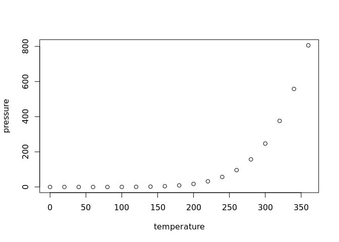

Modelling the invasive American Mink in the Pyrenees
================

## The model

This model is taken from [Catford et
al. 2018](http://www.nature.com/articles/s41467-018-04491-3).

  
 \\left( 1 - \\sum_{j = 1}^{i} p_j \\right) -
        \\left( m_i + \\sum_{j = 1}^{i-1} c_j p_j + h_j \\right) p_i")  

## GitHub Documents

This is an R Markdown format used for publishing markdown documents to
GitHub. When you click the **Knit** button all R code chunks are run and
a markdown file (.md) suitable for publishing to GitHub is generated.

## Including Code

You can include R code in the document as follows:

``` r
summary(cars)
```

    ##      speed           dist       
    ##  Min.   : 4.0   Min.   :  2.00  
    ##  1st Qu.:12.0   1st Qu.: 26.00  
    ##  Median :15.0   Median : 36.00  
    ##  Mean   :15.4   Mean   : 42.98  
    ##  3rd Qu.:19.0   3rd Qu.: 56.00  
    ##  Max.   :25.0   Max.   :120.00

## Including Plots

You can also embed plots, for example:

<!-- -->

Note that the `echo = FALSE` parameter was added to the code chunk to
prevent printing of the R code that generated the plot.
